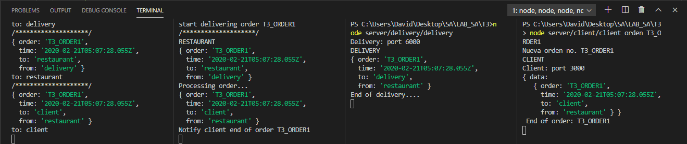

# TAREA 3 - ESB CONCEPTO Y TOPOLOGIA

##### Esteban David Alvarez Bor - 201313872

## Configuracion inicial
Para poder ejecutar correctamente la aplicacion es necesario contar con **NodeJS** en su version __10.16.2__ o superior, 
asi mismo contar con **NPM** para poder obtener los modulos necesarios para su correcto funcionamiento. Ejecutar comando: 

```js
npm install
```  

## SERVICIOS

### **ClIENTE**
Para iniciar el servicio, ejecutar el comando:
```js
node server/cliente/cliente orden NO_ORDER
```
El servicio del cliente envia la nueva orden al ESB el cual se encarga de redireccionar la orden al servicio de restaurante, la **data** a enviar contiene:
1. ID de la orden
2. Fecha y Hora
3. Remitente
4. Destinatario

```js
        axios.post(`http://localhost:${port.EBS_PORT}/esb`, {
            data: {
                order: argv._[1],
                time: new Date(),
                to: 'restaurant',
                from: 'client'
            }
        });
```


### **RESTAURANTE**
Para iniciar el servicio, ejecutar el comando:
```js
node server/restaurant/restaurant
```

El servicio de restaurante se encargara de modificar la orden recibida de acuerdo al origen de la orden para luego reenviarla al ESB el cual se encargara de completar la entrega.

```js
    axios.post(`http://localhost:${port.EBS_PORT}/esb`, {
        data: body
    });
```

### **ENTREGA**
Para iniciar el servicio, ejecutar el comando:
```
node server/delivery/delivery
```
Luego de ser procesada la orden por el servicio de entrega, este envia nuevamente la orden al ESB para poder continuar el flujo del sistema.

```js
    axios.post(`http://localhost:${port.EBS_PORT}/esb`, {
        data: body
    });

```

### **ESB**
El ESB se encarga de determinar el destino de la informacion, estableciendo la comunicacion con los servicios que se encuentran disponibles dentro de su funcionamiento. Para lograr esto, el ESB analiza la data obteniendo el destino de la informacion para poder enviarla. El sistema cuenta con un delay de 2s para poder observar de mejor manera el flujo del sistema.

```js
app.post('/esb', (req, res) => {
    let body = req.body.data;
    /*
    * CODIGO
    */
    switch (body.to) {
        case 'client':
            /*
            * CODIGO
            */
            axios.post(`http://localhost:${port.CLIENT_PORT}/client`, {
                data: body
            });
        case 'restaurant':
            /*
            * CODIGO
            */
            axios.post(`http://localhost:${port.RESTAURANT_PORT}/restaurant`, {
                data: body
            });
        case 'delivery':
            /*
            * CODIGO
            */
            axios.post(`http://localhost:${port.DELIVERY_PORT}/delivery`, {
                data: body
            });
        default:
            /*
            * CODIGO
            */
    }

```

### **DEMOSTRACION**
[Video demostrativo](https://youtu.be/p6PQxDcj9io)


